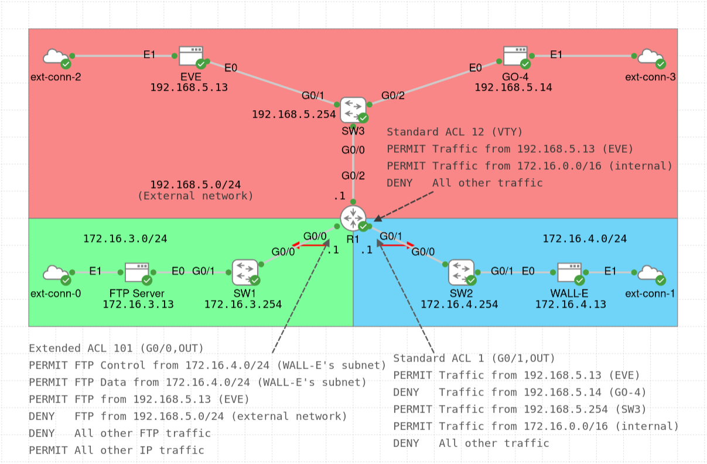

# Access Control Lists Lab

The main focus of this lab is to configure [IPv4 Access Control Lists (ACLs)](https://www.cisco.com/c/en/us/td/docs/switches/lan/c9000/security/acls/acls-configuration-guide/access-control-lists.html) on a router and try out different configurations.

The lab topology was inspired from the book [31 Days Before your CCNA Exam: A Day-By-Day Review Guide for the CCNA 200-301 Certification Exam](https://www.ciscopress.com/store/31-days-before-your-ccna-exam-a-day-by-day-review-guide-9780138214258) by Allan Johnson (Day 9: ACL Implementation).

The router (R1) provides connectivity for the following networks:
- Internal network (172.16.0.0/16), which contains WALL-E's subnet (172.16.4.0/24) and FTP server's subnet (172.16.3.0/24)
- External network (non-172.16.0.0/16; in this lab 192.168.5.0/24) with EVE and GO-4

Below are some comments about the lab configuration:
- The router (R1) has both [standard and extended ACLs](https://www.cisco.com/c/en/us/support/docs/ip/access-lists/26448-ACLsamples.html) configured: one standard ACL for traffic towards WALL-E's subnet (172.16.4.0/24), one standard ACL for VTY connections (e.g. SSH), and one extended ACL for traffic towards the FTP server's subnet (172.16.3.0/24).
- The outbound standard ACL on R1's G0/1 interface (towards WALL-E's subnet) allows (IP) traffic from the internal network (172.16.0.0/16) and from EVE and SW3 (both in the external network, i.e. 192.168.5.0/24). Traffic from GO-4 and all other traffic is not allowed.
- The inbound standard ACL on R1's VTY lines allows EVE and any host from the internal network to log into the router (e.g. using SSH or Telnet, although Telnet is disabled on all devices). Traffic into R1 from all other hosts is not allowed.
- The outbound extended ACL on R1's G0/0 interface (towards FTP server's subnet) allows FTP connections only from WALL-E's subnet and from EVE (given her advanced skills and experience, and because she can be trusted). GO-4 is not allowed to connect to the FTP server, because he has once stolen the plant from EVE, so he cannot be trusted. All other non-FTP traffic is allowed on the interface (meaning that everyone can ping the FTP server). Note that the ACL line matching the `ftp-data` keyword for the destination port is only triggered when the FTP server uses the active mode (see the note for `FTP_Active_Mode.pcap` below).
- As a result of these three ACLs:
    - WALL-E can SSH into SW1, SW2, SW3, and R1 (on all its interfaces). Furthermore, WALL-E can ping EVE and the FTP server, but not GO-4. Finally, WALL-E can connect to the FTP server.
    - EVE can SSH into SW1, SW2, SW3, and R1 (on all its interfaces). Furthermore, EVE can ping WALL-E, the FTP server, and GO-4. Finally, EVE can connect to the FTP server.
    - GO-4 cannot SSH into R1, but can connect to SW1 and SW3 (but not to SW2), although the user for GO-4 is not configured. Furthermore, GO-4 can ping EVE and the FTP server, but not WALL-E. Finally, GO-4 cannot connect to the FTP server.
- All switches (SW1, SW2, SW3) have port security configured on the endpoint-facing interfaces with sticky MAC address learning and default values for other settings (i.e. the maximum of 1 MAC address and the "shutdown" violation mode).
- All switches have the default (global) PortFast configuration together with the global configuration of BPDU Filter (so that no BPDUs are sent from the switch ports). Other STP parameters use their default values. Since this lab does not focus on STP and because no new switches will be connected to the existing switches, this configuration is fine. However, if a new switch needs to be connected to any of the existing switches, the current configuration should be updated to ensure proper STP operation.
- All switches have all their interfaces assigned to VLAN 1 (default VLAN), with VLAN 999 used as the "black hole" VLAN for unused ports. It would be better to have other VLANs configured, however, VLANs are not the focus of this lab.
- Since there is no DHCP server in this lab, the endpoint devices (WALL-E, EVE, GO-4, and FTP Server nodes) are manually configured with a static IP address and a default gateway.
- External connectors are used to download the [vsftpd](https://pkgs.alpinelinux.org/package/edge/community/x86_64/vsftpd) and [lftp](https://pkgs.alpinelinux.org/package/edge/main/x86_64/lftp) packages for FTP server and client applications, respectively (see the [Alpine Wiki](https://wiki.alpinelinux.org/wiki/FTP)).

To connect to the FTP server from a host, run `lftp ftp://cisco@172.16.3.13` (the password is "cisco") and then execute some command (e.g. `ls`). The FTP server uses the passive mode. See the note below for the `FTP_Active_Mode.pcap` file if you want to configure the active mode.

Some of the useful verification commands for this lab are (change the parameters if needed):
- `show access-lists`
- `show ip access-lists`
- `show ip interface G0/0`

Finally, in the [pcaps](./pcaps/) directory, you can find some PCAP files with FTP messages, which you can open in [Wireshark](https://www.wireshark.org/) to see the packet structure:
- `FTP_Passive_Mode.pcap` - captured on the link between R1 and SW1 when EVE connects to the FTP server and executes the `LIST /` command
- `FTP_Active_Mode.pcap` - captured on the link between R1 and SW1 when EVE connects to the FTP server and executes the `LIST /` command, but the FTP server is configured to disable the passive mode (i.e. it uses the active mode); to replicate the FTP active mode, add `pasv_enable=NO` to the `/etc/vsftpd/vsftpd.conf` file on the FTP server and restart the networking service (`sudo rc-service vsftpd restart`); then, on the host, once you run `lftp ftp://cisco@172.16.3.13`, enter `set ftp:passive-mode off` in the `lftp` prompt, and execute some command, e.g. `ls` (for additional information, see [this page](https://blog.geekinstitute.org/2024/11/ftp-server-s.html) and [this page](https://www.baeldung.com/linux/ftp-toggle-active-passive-modes#2-lftp))

A couple of tips for the PCAP files:
- To show only FTP traffic, use the display filter `ftp or ftp-data`
- To make it easier to see the TCP port numbers, right-click on the `Source Port` (`Destination Port`) field in the `Transmission Control Protocol` section of any packet and choose "Apply as Column"
- To replace the IP addresses with host names, right-click on a packet, choose "Edit Resolved Name", and write the name (e.g. FTP Server, EVE)
- If you don't see FTP-DATA messages but instead you see [HiPerConTracer](https://www.wireshark.org/docs/dfref/h/hipercontracer.html), then disable it by right-clicking the "HiPerConTracer Trace Service" section of the packet and choosing "Protocol Preferences" > "Disable HiPerConTracer"

Next to the PCAP files, in the [flow_graphs](./flow_graphs/) directory you can find the flow graphs for the two PCAP files, generated in Wireshark (go to "Statistics" in the Wireshark top menu and choose "Flow Graph").

For more information, check the configuration of the devices (`show running-config` or `show run`), or see [the lab YAML file](./ACL_Lab.yaml). For credentials, see the lab description.
