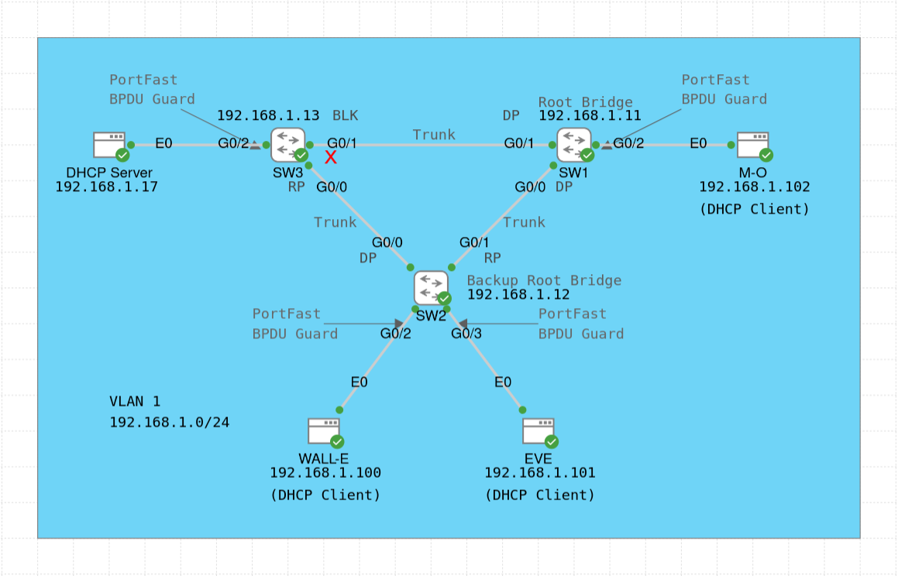

# Basic STP Lab

The main focus of this lab is to configure the Spanning Tree Protocol, specifically the Cisco proprietary [Per-VLAN Spanning Tree Plus (PVST+)](https://www.cisco.com/c/en/us/td/docs/switches/lan/catalyst9500/software/release/17-18/configuration_guide/lyr2/b_1718_lyr2_9500_cg/configuring_spanning_tree_protocol.pdf) protocol, and try out different STP configurations. This is a relatively small lab.

The lab topology was inspired from the book [31 Days Before your CCNA Exam: A Day-By-Day Review Guide for the CCNA 200-301 Certification Exam](https://www.ciscopress.com/store/31-days-before-your-ccna-exam-a-day-by-day-review-guide-9780138214258) by Allan Johnson (Day 25: STP).

All hosts (WALL-E, EVE, M-O, DHCP Server) and Layer 2 switches (SW1, SW2, SW3) are in VLAN 1. Thus, there is no need for a default gateway in this lab.

Below are some comments about the lab configuration:
- SW1 is configured to be the root bridge, and SW2 is configured to be the backup root bridge.
- SW3's G0/1 interface is configured with a higher STP port cost (i.e. 10 instead of the default value of 4 for GigabitEthernet interfaces). As a result, G0/1 goes into the blocking state (despite being directly connected to the root bridge SW1), and G0/0 becomes the root port with the root cost of 8. The only reason for this configuration is to practise STP topology manipulation.
- SW1 is configured with the port priority of 96 on G0/0 and the port priority of 112 on G0/1. Again, there is no reason to do this other than to play around and observe the effects in the transmitted BPDU messages (see the PCAP captures in the [pcaps](./pcaps/) directory).
- All client-facing switch interfaces are configured as PortFast Edge ports, with BPDU Guard enabled (as a protection mechanism against unexpected BPDU messages).
- Neither Root Guard nor Loop Guard are configured on any of the switches, as these features are not applicable for this small network topology.
- All switches have their G0/0 and G0/1 interfaces configured as trunks with the only allowed VLAN set to VLAN 1 and with Dynamic Trunking Protocol (DTP) disabled. In principle, these interfaces could have also been configured as access links. VLAN 999 is used as the "black hole" VLAN for unused ports on all switches.
- All switches implement port security, DHCP snooping, and dynamic ARP inspection (DAI) on their client-facing interfaces. At most one (sticky-learned) MAC address is allowed, and the violation mode is set to "restrict". The aging time is set to 24 hours (1440 minutes) based on inactivity. For DHCP snooping and DAI, the limit rate is set to (on average) 10 packets per second (pps). For DAI, additional validation checks have been enabled (source MAC, destination MAC, and IP address, see the [Cisco tutorial](https://www.cisco.com/c/en/us/td/docs/switches/lan/catalyst9400/software/release/16-9/configuration_guide/sec/b_169_sec_9400_cg/configuring_dynamic_arp_inspection.pdf) for explanation).
- The DHCP server is implemented as a [Tiny Core Linux](https://wiki.tinycorelinux.net/doku.php) host, using the [udhcpd](https://udhcp.busybox.net/README.udhcpd) daemon from the [udhcp server/client package](https://udhcp.busybox.net/), which is part of [BusyBox](https://busybox.net/about.html) (see the [online tutorial](https://iotbytes.wordpress.com/configure-dhcp-server-on-microcore-tiny-linux/)).

Some of the useful verification commands for this lab are (change the parameters if needed):
- `show spanning-tree [vlan 1]`
- `show spanning-tree [vlan 1] interface G0/1 [detail]`
- `show spanning-tree pathcost method`
- `show spanning-tree bridge`
- `show spanning-tree root [cost | port | priority | hello-time | max-age | forward-time]`
- `show interfaces trunk`
- `show vlan [brief]`

Finally, in the [pcaps](./pcaps/) directory, you can find some PCAP files with PVST+ messages, which you can open in [Wireshark](https://www.wireshark.org/) to see the packet structure:
- `DHCP_Flows.pcap` - captured on the link between SW3 and DHCP Server when the lab was started and all DHCP clients (WALL-E, EVE, M-O) requested an IP address; to show the flows for one host only, you can use the display filter `dhcp.id`, e.g. `dhcp.id == 0xe4a43207`; you can also add a column for DHCP Transaction ID by right-clicking on the "Transaction ID" field in the "Dynamic Host Configuration Protocol" section of any frame, and choosing "Apply as Column"
- `STP_SW1_SW2.pcap` - captured on the link between SW1 (root bridge) and SW2 (backup root bridge), with 10 BPDUs sent by SW1; note the value of 0x6001 for the Port identifier: the 4-bit port priority value for SW1's G0/0 port was set to 96 and the 12-bit interface identifier was kept to its default value (i.e. 1)
- `STP_SW1_SW3.pcap` - captured on the link between SW1 (root bridge) and SW3, with 10 BPDUs sent by SW1; note the value of 0x7002 for the Port identifier: the 4-bit port priority value for SW1's G0/1 port was set to 112 and the 12-bit interface identifier was kept to its default value (i.e. 2)
- `STP_SW2_SW3.pcap` - captured on the link between SW2 (backup root bridge) and SW3, with 10 BPDUs sent by SW2; note the value of 0x8001 for the Port identifier: the 4-bit port priority value for SW2's G0/0 port was kept to its default value (i.e. 128) and the 12-bit interface identifier was also kept to its default value (i.e. 1)

For more information, check the configuration of the devices (`show running-config` or `show run`), or see [the lab YAML file](./Basic_STP_Lab.yaml). For credentials, see the lab description.
