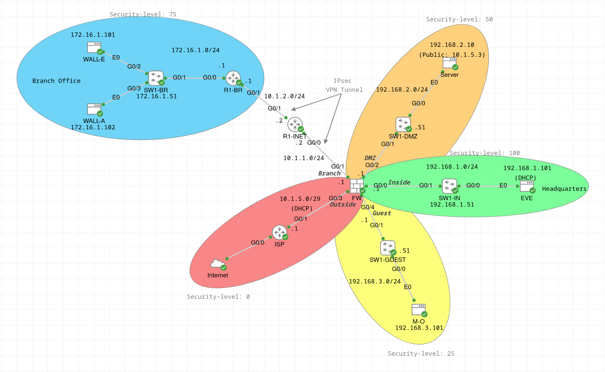

# Firewall and IPsec Lab



The main focus of this lab is to configure the [Cisco ASA firewall](https://www.cisco.com/c/en/us/support/security/adaptive-security-appliance-asa-software/series.html) and try out different configuration options for the [firewall](https://www.cisco.com/c/en/us/td/docs/security/asa/asa923/configuration/firewall/asa-923-firewall-config.pdf) and for [IPsec VPN](https://www.cisco.com/c/en/us/td/docs/security/asa/asa923/configuration/vpn/asa-923-vpn-config.pdf).

The lab topology was inspired from the Cisco U. course [Introduction to Network Simulations with Cisco Modeling Labs](https://u.cisco.com/paths/introduction-network-simulations-with-cisco-modeling-labs-243). The lab configuration was inspired from the online course [Understanding the Cisco ASA Firewall](https://www.oreilly.com/videos/understanding-the-cisco/9781491969656/) by Jimmy Larsson.


## Setup notes

**NB! Due to some CML limitations when importing the lab YAML file, not everything will work as it should. Therefore, some fixes need to be applied, which are described below.**

First, the configured passwords on Cisco ASA will not be set correctly, meaning that you will not have access to the firewall. To fix this issue, delete the following two lines from the device configuration (in the "CONFIG" tab when clicking on the node):
- `enable password ***** pbkdf2`
- `aaa authentication enable console LOCAL`

Save the configuration and start the node. When entering the enable mode, type the new password (e.g. *ciscoasa*, must be at least 8 characters). In the global configuration mode, enter again the commands to create users (e.g. `username cisco password ciscoasa privilege 15`, see the lab description section in the lab YAML file for the intended credentials). Optionally, set the enable mode to use local authentication (i.e. using username and password) with the command `aaa authentication enable console LOCAL`.

Furthermore, you need to fix the PSK configuration on the Cisco ASA firewall in a similar way:
```
FW(config)# tunnel-group 10.1.2.1 ipsec-attributes 
FW(config-tunnel-ipsec)# ikev2 remote-authentication pre-shared-key cisco
FW(config-tunnel-ipsec)# ikev2 local-authentication pre-shared-key cisco
```
(where *cisco* is the intended PSK).
 
Finally, run `crypto key generate rsa modulus 4096` in the global configuration mode on the Cisco ASA firewall and other devices for SSH access.


## Description

The Cisco ASA firewall divides the network into the following security zones:
- *Inside*: 192.168.1.0/24, the headquarters with EVE
- *Branch*: 172.16.1.0/24, the branch office with WALL-E and WALL-A
- *Guest*: 192.168.3.0/24, the guest network with M-O
- *DMZ*: 192.168.2.0/24, the externally accessible network with the Server (running HTTP and HTTPS services)
- *Outside*: 10.1.5.0/29, the external network with the ISP router which provides access to the Internet (in this case, an external connector in the NAT mode)

The Server in the DMZ is running four services (simulated with the [netcat](https://linuxvox.com/blog/using-busybox-version-of-netcat-for-listening-tcp-port/) utility):
- HTTP service for internal users (port 80)
- HTTPS service for internal users (port 443)
- HTTP service for external users (port 8080, accessible via port 80)
- HTTPS service for external users (port 8088, accessible via port 443)

Note: Each service is simulated by the [start_listener.sh](./start_listener.sh) script. This allows users to repeatedly connect to the services. However, only one user at a time can be connected to each service. To simulate a service manually, use `nc -l -p 80`. While this approach works for testing, there are also [more suitable tools](https://cr.yp.to/ucspi-tcp/tcpserver.html) for this task.

The Branch network edge router (R1-BR) and the Cisco ASA firewall (FW) are VPN peers that create a VPN tunnel between Branch network and the Branch interface of the firewall. 


## Access Control Lists (ACLs)

In this lab, the following access rules are configured on the Cisco ASA firewall:
- For the Headquarters/Internal network (*Inside_Access*):
    - Everyone can ping WALL-E (in the Branch Office)
    - Everyone can ping M-O (in the Guest network)
    - Everyone has access to the DMZ network (including internal and external HTTP and HTTPS services on the Server)
    - Everyone has access to the Internet (Outside zone) for general services (HTTP, HTTPS, DNS, ICMP)
    - All other traffic is not allowed (including access to Branch network and Guest network)
- For the Branch Office (*Branch_Access*):
    - WALL-E can ping anyone in Inside network
    - WALL-E and WALL-A can ping M-O in the Guest network
    - Everyone has access to internal and external HTTP and HTTPS services on the Server in the DMZ
    - Everyone has access to the Internet (Outside zone) for general services (HTTP, HTTPS, DNS, ICMP)
    - All other traffic is not allowed (including access to Inside network, DMZ, and Guest network)
- For the Guest Network (*Guest_Access*):
    - Everyone has access to external HTTP and HTTPS services on the Server in the DMZ
    - Everyone has access to the Internet (Outside zone) for general services (HTTP, HTTPS, DNS, ICMP)
    - All other traffic is not allowed (including access to Inside network, Branch network, DMZ, and internal HTTP and HTTPS services)
- For DMZ (*DMZ_Access*):
    - Everyone has access to the Internet (Outside zone) for general services (HTTP, HTTPS, DNS, ICMP)
    - All other traffic is not allowed (including access to Inside network, Branch network, and Guest network)
- For the Outside Network (*Outside_Access*):
    - Everyone has access to external HTTP and HTTPS services on the Server in the DMZ
    - All other traffic is not allowed

To access the Server, you can use `netcat`, e.g. `nc -v 192.168.2.10 80`. On Cisco routers and switches, you can use Telnet, e.g. `telnet 10.1.5.3 80` on ISP router (the connection will be closed, but the welcome message will be shown). To test Internet connectivity, you can use `ping` or `netcat`, e.g. `ping google.com` or `nc -v www.cisco.com 80`.

Note: To remove an access list, use the `clear config` command (e.g. `clear config access-list Inside_Access`); the intuitive `no` command does not work in this case. To remove a line in an access list, the `no` command does work (e.g. `no access-list Outside_Access line 3`).

To see all configured access rules, use `show run access-list` (or `show run access-list Inside_Access` for a specific ACL) and `show run access-group`. Alternatively, use `show access-list` (or `show access-list Inside_Access` for a specific ACL) to see the expanded entries and the hit counts, and use `show access-group` to see where the access lists are applied.


## Network Address Translation (NAT)

For outbound Internet access (i.e. traffic going to the Outside interface), the following NAT configuration is used:
- *Inside network*: dynamic NAT behind FW's Outside interface (G0/3)
- *Branch network*: dynamic NAT behind 10.1.5.4
- *Guest network*: dynamic NAT behind 10.1.5.6
- *DMZ*: dynamic NAT behind 10.1.5.5

For accessing the external HTTP and HTTPS services on the Server in DMZ, the following NAT configuration is used:
- *External HTTP service*: accessible via 10.1.5.3:80, static NAT to 192.168.2.10:8080
- *External HTTPS service*: accessible via 10.1.5.3:443, static NAT to 192.168.2.10:8088

Note that with a VPN client or a VPN tunnel (site-to-site VPN) on the Internet (Outside interface), you need to exempt inside-to-VPN client traffic and traffic going over the VPN tunnel from the interface NAT/PAT rules by using an identity NAT rule between the corresponding networks (i.e. translate an address to the same address). This could be done using a twice NAT, e.g.:
- `nat (Inside,Outside) source static Inside_Network Inside_Network destination static VPN_Clients VPN_Clients`, or
- `nat (Inside,Outside) source static Inside_Network Inside_Network destination static Remote_Network Remote_Network`.

However, in this lab such twice NAT configuration is not needed, because there are no VPN clients or VPN tunnels on the Outside network (towards the Internet). Instead, the VPN tunnel is used only between the Cisco ASA firewall and the Branch network, and there is no need to have Internet access via the Branch interface.

To see all configured NAT rules, use `show run nat` or `show nat`.


## Network and service objects

An important concept in Cisco ASA firewall configuration is an object. Objects are reusable components that can be used in ASA configurations, e.g. in place of inline IP addresses, services, names etc. (see the [configuration guide](https://www.cisco.com/c/en/us/td/docs/security/asa/asa923/configuration/firewall/asa-923-firewall-config.pdf) for more details). In particular:
- *Network objects and groups* identify IP addresses or host names: a network object contains a host, a network IP address, a range of IP addresses, or a fully qualified domain (FQDN), whereas a network object group can include multiple network objects as well as inline networks or hosts
- *Service objects and groups* identify protocols and ports: a service object contains a single protocol specification, whereas a service object group can include a mix of protocols

This lab uses both network and service objects and object groups, for example, to define networks (e.g. Inside network, Branch network, DMZ, Guest network, Outside network), hosts (e.g. Server, WALL-E, WALL-A, M-O), and services (e.g. internal HTTP and HTTPS services, external HTTP and HTTPS services). In addition, the service object group *General_Services* defines, as the name suggests, general services that can be accessed on the Internet, such as web traffic (HTTP, HTTPS), DNS traffic, and ICMP traffic for troubleshooting (e.g. ping, traceroute).

To see all configured network and service objects and object groups, use respectively:
- `show run object network` (or `show object network`)
- `show run object-group network` (or `show object-group network`)
- `show run object service` (or `show object service`)
- `show run object-group service` (or `show object-group service`)


## Site-to-site IPsec VPN

A site-to-site (LAN-to-LAN) IPsec virtual private network (VPN) is configured between Branch network and Cisco ASA firewall. Specifically, R1-BR and FW are the two peers that create the VPN tunnel.

[IPsec](https://datatracker.ietf.org/doc/rfc4301/) security associations (SAs) are created using the *Internet Security Association and Key Management Protocol (ISAKMP)* negotiation protocol. ISAKMP separates negotiation into two phases:
- Phase 1 creates the tunnel protecting later ISAKMP negotiation messages (IKE SA)
- Phase 2 creates the tunnel protecting the actual data (IPsec SA)

Internet Key Exchange (IKE) uses ISAKMP to set up the SA for IPsec and creates the cryptographic keys used to authenticate the peers (for more information, see the [Cisco ASA VPN configuration guide](https://www.cisco.com/c/en/us/td/docs/security/asa/asa923/configuration/vpn/asa-923-vpn-config.pdf)). In this lab, only [IKE version 2 (IKEv2)](https://datatracker.ietf.org/doc/rfc7296/) is used, as IKEv1 is [deprecated](https://datatracker.ietf.org/doc/rfc9395/). Similarly, only [Encapsulating Security Payload (ESP)](https://datatracker.ietf.org/doc/rfc4303/) protocol is considered.

Below is the IPsec VPN configuration for the Cisco ASA firewall used in this lab. In general, two profiles are configured: one profile using Authenticated Encryption with Associated Data (AEAD) and one profile using a non-AEAD cipher and authentication. For information about cryptographic algorithm implementation requirements and usage guidance, see [RFC 8221](https://www.rfc-editor.org/rfc/rfc8221) for IPsec and [RFC 8247](https://www.rfc-editor.org/rfc/rfc8247) for IKEv2. For IKEv2 parameters, see [IANA IKEv2 registry](https://www.iana.org/assignments/ikev2-parameters/ikev2-parameters.xhtml).

Two IKEv2 policies are configured (see `show run crypto ikev2`):
- IKEv2 Policy 10 (AEAD)
    - Encryption: AES-GCM-256
    - Integrity: NULL
    - DH Groups: 21 (NIST 521-bit ECP Group), 20 (NIST 384-bit ECP Group), 16 (4096-bit MODP Group)
    - PRF: SHA-512
    - Lifetime: 14400 seconds (4 hours)
- IKEv2 Policy 20 (non-AEAD)
    - Encryption: AES-256
    - Integrity: SHA-512, SHA-384
    - DH Groups: 21 (NIST 521-bit ECP Group), 20 (NIST 384-bit ECP Group), 16 (4096-bit MODP Group)
    - PRF: SHA-512, SHA-384
    - Lifetime: 10800 seconds (3 hours)

Two IPsec ESP proposals are configured (see `show run crypto ipsec`):
- AEAD Proposal: AES-GCM-256
- Non-AEAD Proposal: AES-256 with SHA-512 or SHA-384

(IKEv2 proposal (or IKEv1 transform set) is a combination of security protocols and algorithms defining how to protect the traffic.)

The "interesting traffic" (i.e. traffic to be protected with IPsec) is defined as any IPv4 traffic sent to Branch network (see `show [run] access-list VPN_Traffic`). As a result, R1-INET does not need to know the routes to Branch network, Inside network, and other networks.

A tunnel group (a set of records containing tunnel connection policies) is configured for the peer R1-BR with the type IPsec LAN-to-LAN (L2L) and pre-shared key (PSK) authentication using the PSK `cisco` (see `show run tunnel-group`).

Crypto map is configured to define the IPsec policy to be negotiated in the IPsec SA. The crypto map configuration includes (see `show run crypto map`):
- Specifying the ACL to match the interesting traffic
- Specifying R1-BR as the peer
- Specifying the two configured IPsec proposals (AEAD and non-AEAD)
- Configuring DH Group 21 (NIST 521-bit ECP Group) to be used for Perfect Forward Secrecy (PFS)
- Setting the SA lifetime to 7200 seconds (2 hours)

Both IKEv2 and the crypto map are enabled on the Branch interface (the interface that terminates the VPN tunnel).

Note that the interface ACL is still applied to IPsec traffic with the `no sysopt connection permit-vpn` command, which reverses the default behaviour of letting IPsec packets bypass interface ACLs. In this lab, such configuration is fine, since only traffic from Branch network (i.e. 172.16.1.0/24) should reach the firewall.

Analogous VPN configuration is used on R1-BR as the VPN peer. This includes configuration of
- IKEv2 proposal (see `show crypto ikev2 proposal`),
- IKEv2 policy (see `show crypto ikev2 policy`),
- IKEv2 keyring (see `show run | section crypto ikev2 keyring`),
- Crypto ACL (see `show access-list VPN_Traffic`),
- IPsec transform set (see `show crypto ipsec transform-set`),
- IKEv2 profile (see `show crypto ikev2 profile`), and
- Crypto map (see `show crypto map [interface G0/1]`),

as well as enabling the crypto map on the G0/1 interface (see `show run interface G0/1`). The crypto map gathers the IKEv2 and IPsec parameters and attaches the crypto functionality to an interface. See the [online tutorial](https://community.cisco.com/t5/security-knowledge-base/site-to-site-ikev2-ipsec-vpn-implementation/ta-p/5304831) for the explanations (or see [this port](https://www.cisco.com/c/en/us/support/docs/security-vpn/ipsec-negotiation-ike-protocols/117337-config-asa-router-00.html) or [this post](https://www.cisco.com/c/en/us/support/docs/security-vpn/internet-security-association-key-management-protocol-isakmp/223291-implementing-ikev2-route-based-site-to.html) for further information).

To see the IKEv2 and IPsec SAs, use `show crypto ikev2 sa` and `show crypto ipsec sa`, respectively.

For more information about IPsec VPN configuration and advanced features, see the [Cisco Secure Firewall ASA VPN CLI Configuration Guide](https://www.cisco.com/c/en/us/td/docs/security/asa/asa923/configuration/vpn/asa-923-vpn-config.pdf), especially, Chapter 1 (IPsec and ISAKMP) and Chapter 8 (LAN-to-LAN IPsec VPNs).


## Other lab comments

For general firewall configuration, note the following points:
- Since there is no need to block traffic between interfaces with the same security level (whether the same interface or different interfaces), the corresponding feature is disabled using `same-security-traffic permit inter-interface` and `same-security-traffic permit intra-interface` commands.
- The `fixup protocol icmp` command is used to tell the firewall to treat all ICMP traffic stateful to allow troubleshooting using ICMP messages.
- The firewall can only be accessed via SSH or the console port. SSH access is allowed only from Inside network and Branch network. Enable access uses local authentication (i.e. using username and password). Use `show run aaa authentication` and `show run ssh` to see the configuration.


## Useful verification commands

Below are some useful `show` commands for Cisco ASA firewall:
- Interface configuration:
    - `show ip`
    - `show ip address [Outside]`
    - `show interface ip brief`
    - `show run interface [G0/0]`
- Management access:
    - `show run ssh`
    - `show run telnet`
    - `show run http`
    - `show run aaa authentication`
- Objects:
    - `show [run] object`
    - `show [run] object network`
    - `show [run] object-group network`
    - `show [run] object service`
    - `show [run] object-group service`
- Access Control Lists:
    - `show access-list`
    - `show access-group`
    - `show run access-list`
    - `show run access-group`
- NAT configuration:
    - `show run nat`
    - `show nat object Inside_Network`
    - `show nat detail`
- Connection and translation tables:
    - `show conn`
    - `show xlate`
- DHCP server configuration:
    - `show run dhcpd`
    - `show dhcpd binding`
    - `show dhcpd state`
    - `show dhcpd statistics`
- IPsec VPN configuration:
    - `show run crypto`
    - `show run crypto ikev2`
    - `show run crypto ipsec`
    - `show run tunnel-group`
    - `show run crypto map`
    - `show crypto ikev2 sa [detail]`
    - `show crypto ipsec sa [detail]`
    - `show ipsec stats`
- Firewall mode:
    - `show firewall`


## PCAP files

In the [pcaps](./pcaps/) directory, you can find a PCAP file with ISAKMP messages, captured on the link between R1-BR and R1-INET, which you can open in [Wireshark](https://www.wireshark.org/) to see the packet structure. To replace the IP addresses with host names, right-click on a packet, choose "Edit Resolved Name", and write the name (e.g. R1-BR or FW).

Next to the PCAP file, in the [flow_graphs](./flow_graphs/) directory you can find the flow graph for this PCAP file, generated in Wireshark (go to "Statistics" in the Wireshark top menu and choose "Flow Graph").


## Other information

For more information, check the configuration of the devices (`show running-config` or `show run`), or see [the lab YAML file](./Firewall_IPsec_Lab.yaml). For credentials, see the lab description.
