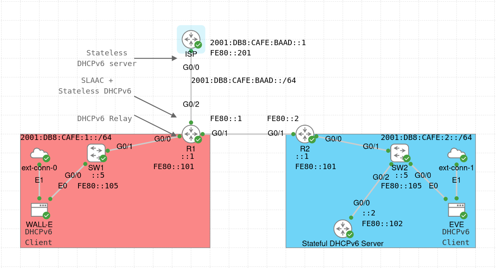

# IPv6 Lab



The main focus of this lab is to implement IPv6 on two routers (R1, R2) and try out different IPv6 configurations.
Specifically, the lab focuses on configuring stateful and stateless DHCPv6 servers, DHCPv6 relay, ICMPv6 Neighbor Discovery Protocol (NDP), Global Unicast Addresses (GUA), Link-Local Addresses (LLA), Stateless Address Auto-Configuration (SLAAC), and IPv6 (default) static routes.

The lab configuration was inspired from the online course [IPv6 Fundamentals LiveLessons: A Straightforward Approach to Understanding IPv6](https://www.ciscopress.com/store/ipv6-fundamentals-livelessons-a-straightforward-approach-9781587204579) by Rick Graziani.

Each of the two routers in this lab is connected to a LAN subnet on its GigabitEthernet 0/0 interface:
- R1 is connected to WALL-E's subnet
- R2 is connected to EVE's subnet


Below are some comments about the lab configuration:
- Both subnets receive their IPv6 GUAs from a stateful DHCPv6 server in EVE's subnet. R1 acts as a DHCPv6 relay in WALL-E's subnet.
- R1's interface facing the ISP router is configured to use SLAAC. It will also use a stateless DHCPv6 server configured on the ISP router.
- For both stateful and stateless DHCPv6, the DNS server address (2001:DB8:F00D:BAAD::1) is non-existent. DNS configuration is not the focus of this lab, so it is sufficient that the hosts simply receive this address.
- Both routers (R1, R2) tell the hosts not to use the Router Advertisement (RA) prefix to create a temporary (SLAAC) address. This is done by setting the Autonomous Address Configuration Flag (A) to 0 (see the `ipv6 nd prefix 2001:DB8:CAFE:1::/64 no-autoconfig` command).
- The stateful DHCPv6 server uses /80 address prefix in both DHCPv6 pools to exclude some addresses from assignment. Furthermore, the prefix lifetimes are set to 3 days (259,200 seconds) for the valid lifetime (i.e. the address can be used for existing application flows) and 1.5 days (129,600 seconds) for the preferred lifetime (i.e. the address is used for new and existing application flows); this is done just for practice reasons. The link-address prefix is used to match the correct DHCPv6 pool, depending on the DHCPv6 message source (i.e. WALL-E or EVE).
- The (WAN) link between R1 and R2 uses only LLAs without GUAs, because having GUAs is not needed on that link.
- IPv6 GUAs use general prefix in address configuration (a shortcut or alias, which allows for automated prefix definition, making it easier to write IPv6 addresses and simplifying network renumbering).
- IPv6 LLAs are mostly hardcoded for easier use. An exception is R1's G0/2 interface, where the LLA is generated using EUI-64 (default behaviour), just to see some different output from IPv6 commands (ideally, the configuration should be consistent). The hosts (WALL-E and EVE) also use their own process of generating LLAs.
- All switches have all their interfaces assigned to VLAN 1 (default VLAN). It would be better to have other VLANs configured, however, VLANs are not the focus of this lab.
- External connectors are used to download the [dhcpcd](https://pkgs.alpinelinux.org/package/edge/main/x86_64/dhcpcd) package to configure a DHCP(v6) client on the host nodes (WALL-E and EVE).


Some of the useful verification commands for this lab are (change the parameters if needed):
- `show ipv6 interface brief`
- `show ipv6 interface G0/0`
- `show ipv6 route [connected | local | static]`
- `show ipv6 route 2001:DB8:CAFE:BAAD::1`
- `show ipv6 static detail`
- `show ipv6 neighbors`
- `show ipv6 routers`
- `show ipv6 dhcp binding` (on Stateful DHCPv6 Server)
- `show ipv6 dhcp pool` (on Stateful DHCPv6 Server and ISP)

On host nodes (WALL-E and EVE), you can use the `ping` command to test connectivity:
```sh
# Ping the default gateway (GUA)
EVE:~$ ping -6 2001:DB8:CAFE:2::1
# Ping the default gateway (LLA)
EVE:~$ ping -6 -I eth0 FE80::101
# Ping WALL-E (assuming the GUA below)
EVE:~$ ping -6 2001:DB8:CAFE:1:F00D:40BF:5604:695E
# Ping the ISP router
EVE:~$ ping -6 2001:DB8:CAFE:BAAD::1
```

To verify the IPv6 configuration on hosts, you can use the `ip` command:
```sh
# Show the IPv6 configuration on eth0
EVE:~$ ip -6 address show dev eth0
# Show the entire configuration
EVE:~$ ip address
# Show the IPv6 routing table
EVE:~$ ip -6 route
EVE:~$ ip -6 route show dev eth0
# Show the IPv6 routing table using another command
EVE:~$ route -A inet6
```

To check the obtained DNS server address, you can run `cat /etc/resolv.conf`.

Note that if WALL-E and/or EVE boot before the DHCPv6 server, they will not have an IPv6 GUA assigned. If this happens, run `sudo rc-service networking restart` on the host once the DHCPv6 server is up.


Finally, in the [pcaps](./pcaps/) directory, you can find some PCAP files with ICMPv6 NDP and DHCPv6 messages, which you can open in [Wireshark](https://www.wireshark.org/) to see the packet structure:
- `DHCPv6_On_Start.pcap` - captured between EVE and SW2 when the EVE node is powered on
- `DHCPv6_On_Restart.pcap` - captured between EVE and SW2 when the EVE node restarts the networking service (with `sudo rc-service networking restart` command)
- `DHCPv6_Relay.pcap` - captured between WALL-E and SW1 when the WALL-E node is powered on
- `DHCPv6_Relay_Forward.pcap` - captured between R1 and R2 when the WALL-E node is powered on (this file complements the `DHCPv6_Relay.pcap` file, showing DHCPv6 message forwarding by the DHCPv6 relay)
- `DHCPv6_SLAAC.pcap` - captured between R1 and ISP when R1's G0/2 interface is brought up (the file includes DHCPv6 Information-request messages sent to the stateless DHCPv6 server on ISP)

A couple of tips for the PCAP files:
- If you capture the traffic in CML, you can use the following filter in Wireshark to keep only ICMPv6 and DHCPv6 messages: `dhcpv6 or icmpv6 and icmpv6.type != 143` (the last comparison excludes ICMPv6 "Multicast Listener Report Message v2" messages). 
- To make the capture more readable, you can configure names for IPv6 addresses. Right-click on a packet, choose "Edit Resolved Name", and write the name (e.g. R1, R2, WALL-E, EVE, DHCPv6 Server, ISP).
- To make it easier to see who sends what, you can add a "Source MAC" column. Right-click on the "Source" field of any "Ethernet II" frame, and choose "Apply as Column".

Next to the PCAP files, in the [debug](./debug/) directory you can find some debugging logs from the DHCP Server node (obtained using the `debug ipv6 dhcp detail` command). These logs correspond to the `DHCPv6_On_Start.pcap` and `DHCPv6_On_Restart.pcap` files.


For more information, check the configuration of the devices (`show running-config` or `show run`), or see [the lab YAML file](./IPv6_Lab.yaml). For credentials, see the lab description.
