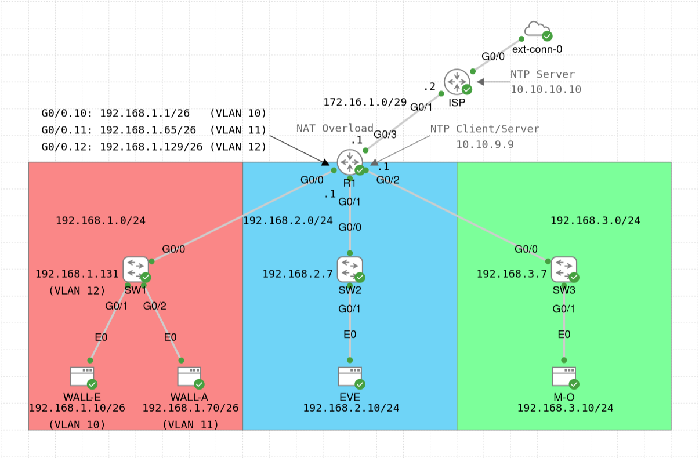

# Misc Lab

This lab does not focus on implementing or configuring one specific feature. Instead, miscellaneous features are configured on devices, including [dynamic NAT with overload](https://www.cisco.com/c/en/us/support/docs/ip/network-address-translation-nat/13772-12.html) (using a NAT pool), [Cisco Discovery Protocol (CDP)](https://www.cisco.com/c/en/us/support/docs/network-management/discovery-protocol-cdp/43485-cdponios43485.html), [Link Layer Discovery Protocol (LLDP)](https://www.cisco.com/c/en/us/td/docs/ios/cether/configuration/guide/ce_lldp-med.html), and a very basic configuration of [Network Time Protocol (NTP)](https://www.cisco.com/c/dam/en/us/td/docs/ios-xml/ios/bsm/configuration/xe-3se/3650/bsm-xe-3se-3650-book.html). The lab was initially created as a playground and it is (chronologically) the first created CML lab in this repository.

The router (R1) provides connectivity for the following internal subnets:
- WALL-E's and WALL-A's subnet (192.168.1.0/24, which is further subnetted using the /26 subnet mask)
- EVE's subnet (192.168.2.0/24)
- M-O's subnet (192.168.3.0/24)

Below are some comments about the lab configuration:
- R1 implements a dynamic NAT with overload using a NAT pool: the traffic from the three subnets (WALL-E's and WALL-A's subnet, EVE's subnet, and M-O's subnet) to the ISP router is translated using a pool of four addresses (corresponding to the unused addresses in the subnet on the link between R1 and ISP, i.e. 172.16.1.0/29).
- The NTP configuration is very basic: the ISP router acts as the NTP server (using its Loopback 0 interface as the source), while R1 and the three switches (SW1, SW2, SW3) operate in the NTP client/server mode (i.e. configured with the `ntp server` command), with the switches using R1's Loopback 0 interface address as the NTP server. Note that it might take quite some time for the devices to synchronize (per the `show ntp status` command output). Such a basic configuration is not secure, so following [best practices](https://www.cisco.com/c/en/us/support/docs/availability/high-availability/19643-ntpm.html) is recommended outside this playground lab. In addition, using a proper NTP server instead of a router would be a much better idea.
- The hosts are configured to synchronize their time using [chrony](https://chrony-project.org/) NTP implementation (see an [online tutorial](https://krython.com/post/configuring-ntp-server) for more information). The configuration uses R1 as the NTP server. IMPORTANT: To install the required packages, the hosts need connectivity to the Internet, which is provided with the external connector attached to the ISP router. However, if the host nodes boot before the router and the switches, they will fail to install the packages. If this is the case, restart the host nodes when the entire lab is up and running.
- All internal devices (R1, SW1, SW2, SW3) have CDP and LLDP enabled on all interfaces (except for R1's G0/3 interface towards the ISP router). Both protocols have the timer set to 40 seconds and the holdtime set to 160 seconds. The reason for enabling both protocols is to observe the traffic on the links (see the `CDP_LLDP.pcap` file in the [pcaps](./pcaps/) directory).
- All switches have the default (global) PortFast configuration together with the global configuration of BPDU Filter (so that no BPDUs are sent from the switch ports). Other STP parameters use their default values. Since this lab does not focus on STP and because no new switches will be connected to the existing switches, this configuration is fine. However, if a new switch needs to be connected to any of the existing switches, the current configuration should be updated to ensure proper STP operation.
- SW1 has four VLANs: VLAN 10 (WALL-E's VLAN), VLAN 11 (WALL-A's VLAN), VLAN 12 (management VLAN, for logging into SW1), and VLAN 999 ("black hole" VLAN for unused ports). Therefore, R1's G0/0 physical interface has three subinterfaces to implement inter-VLAN routing (i.e. R1 is configured as Router-on-a-Stick (ROAS) on its G0/0 interface). Both SW2 and SW3 have their only host assigned to VLAN 1 (default VLAN, which is also used as the management VLAN), with VLAN 999 used as the "black hole" VLAN for unused ports and with the switch interfaces connected to R1 configured as access links.
- All switches (SW1, SW2, SW3) have port security configured on the endpoint-facing interfaces with sticky MAC address learning and default values for other settings (i.e. the maximum of 1 MAC address and the "shutdown" violation mode).

Some of the useful verification commands for this lab are (change the parameters if needed):
- CDP and LLDP:
    - `show cdp | lldp`
    - `show cdp | lldp neighbors G0/0`
    - `show cdp | lldp neighbors detail`
    - `show cdp | lldp entry R1.axiom.bnl`
    - `show cdp | lldp interface G0/0`
    - `show cdp | lldp traffic`
- NTP
    - `show ntp status`
    - `show ntp associations`
- NAT
    - `show ip nat statistics`
    - `show ip nat translations [verbose]`
- Port security
    - `show port-security`
    - `show port-security interface G0/1`
    - `show mac address-table secure`
    - `show mac address-table static`
- VLANs
    - `show interfaces status`
    - `show interfaces G0/0 switchport`
    - `show interfaces trunk`
    - `show interfaces G0/0 trunk`
    - `show vlan [brief]`
    - `show vlan id 10`
    - `show vlan name WALL-E_VLAN`
    - `show vlans` (on R1)
    - `show vtp status`

Finally, in the [pcaps](./pcaps/) directory, you can find some PCAP files with CDP, LLDP, and NTP messages, which you can open in [Wireshark](https://www.wireshark.org/) to see the packet structure:
- `CDP_LLDP.pcap` - captured on the link between SW1 and R1; R1 sends CDP messages from its G0/0 (physical) interface and LLDP messages from its G0/0 (physical) interface and its subinterfaces (i.e. G0/0.10, G0/0.11, G0/0.12); SW1 sends CDP and LLDP messages from its G0/0 interface; note that SW1 (and other switches) do not advertise enabled capabilities in LLDP messages for some reason and some other information might also be missing, however, the capture still provides an overview of the structure of CDP and LLDP messages; use the `cdp` or `lldp` display filters to show only CDP or LLDP messages, respectively
- `NTP.pcap` - captured on the link between R1 and the ISP router; the capture contains some NTP messages between these devices (with the ISP router acting as the NTP server and R1 acting as the NTP client)

For more information, check the configuration of the devices (`show running-config` or `show run`), or see [the lab YAML file](./Misc_Lab.yaml). For credentials, see the lab description.
