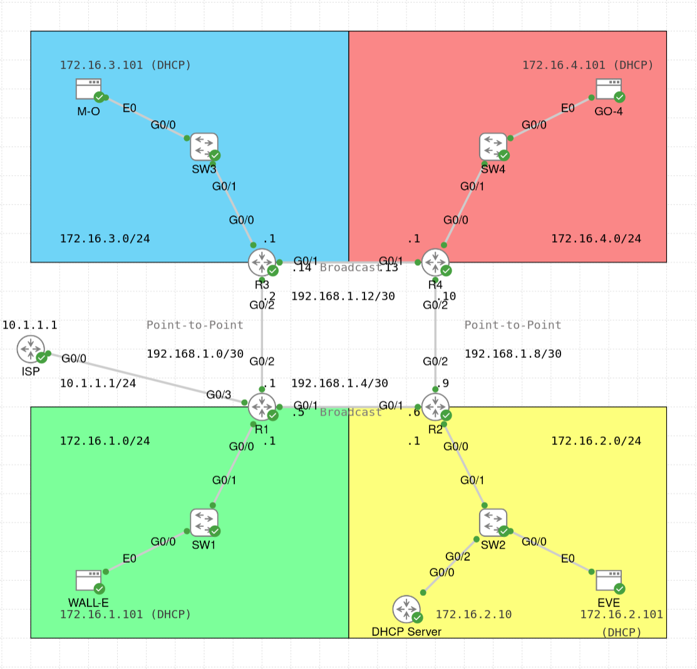

# OSPF Lab

The main focus of this lab is to implement the Open Shortest Path First (OSPF) protocol on four routers (R1, R2, R3, R4) and try out different OSPF configurations.
The lab focuses on the single-area OSPF and uses the OSPF version 2 (OSPFv2).
In addition, this lab also implements the following features:
- (Default) Floating static routes on the four routers (R1, R2, R3, R4)
- DHCP relay on the routers with no DHCP server in their LAN subnets (i.e. R1, R3, and R4, because the DHCP server is in R2's LAN)
- NAT overload (aka PAT) on the router facing the ISP (i.e. the router that acts as an ISP router)
- Port security, DHCP snooping, and dynamic ARP inspection on the four switches (SW1, SW2, SW3, SW4)

Each of the four routers in this lab is connected to a LAN subnet on its GigabitEthernet 0/0 interface:
- R1 is connected to WALL-E's subnet
- R2 is connected to EVE's subnet
- R3 is connected to M-O's subnet
- R4 is connected to GO-4's subnet

Below are some comments about the lab configuration:
- The (WAN) links between R1 and R2 and between R3 and R4 have the OSPF network type "broadcast", while the (WAN) links between R1 and R3 and between R2 and R4 have the OSPF network type "point-to-point". In principle, all four links can be set to "point-to-point", since they have only two routers. However, this lab uses both types to observe the differences.
- For R2 and R3, the OSPF cost on the interfaces facing R4 is set to a higher value, so that the route via R1 is prioritized (unless the traffic needs to go to R4). This is because R4 is connected to GO-4's LAN, and, as you might remember, GO-4 has stolen the plant from EVE, so he is less trustworthy. For the same reason, R4 has OSPF priority set to 0 on G0/1 interface, so that it never becomes a designated router on that subnet.
- R1 builds a static default route based on the information received from the ISP router that is configured as a DHCP server for the subnet between R1 and ISP. R1 advertises this default route with OSPF to other routers.
- WALL-E and EVE should be able to ping each other even if OSPF fails. Therefore, a floating static route (i.e. a route with a higher administrative distance) is added between R1 and R2.
- All characters should be able to ping the ISP (i.e. get access to the Internet) even if OSPF fails. Therefore, R1 has floating static routes to the LANs connected to R2, R3, and R4, and each router has a default floating static route to R1. Additional floating static routes that are needed to have this connectivity are added to R1, R2, R3, and R4. Apart from these two requirements, connectivity between the characters in the absence of OSPF is not important for this lab.
- OSPF configuration is not always consistent across all routers (e.g. R4 uses Loopback 0 interface for its router ID instead of `router-id` router configuration subcommand; R3 and R4 use `network` commands to enable OSPF on interfaces instead of `ip ospf x area y` interface subcommand; R1 and R2 have non-default hello and dead intervals). This is done to practise different configuration options. In general, configuration should be consistent on all devices.
- All switches have all their interfaces assigned to VLAN 1 (default VLAN). It would be better to have other VLANs configured, however, VLANs are not the focus of this lab.

Some of the useful verification commands for this lab are (change the parameters if needed):
- OSPF:
    - `show ip ospf`
    - `show ip ospf interface G0/1`
    - `show ip ospf interface brief`
    - `show ip ospf neighbor [G0/1]`
    - `show ip ospf database`
    - `show ip protocols`
    - `show ip route [ospf]`
    - `show ip route 10.1.1.1`
- NAT/PAT:
    - `show ip nat translations`
    - `show ip nat statistics`
- Port security:
    - `show port-security`
    - `show port-security interface G0/0`
- DHCP snooping:
    - `show ip dhcp snooping`
    - `show ip dhcp snooping binding`
    - `show ip dhcp snooping statistics [detail]`
- Dynamic ARP inspection:
    - `show ip arp inspection`
    - `show ip arp inspection statistics`
    - `show ip arp inspection interfaces`
- DHCP:
    - `show ip dhcp pool EVE_POOL`
    - `show ip dhcp binding`
    - `show ip dhcp conflict`
    - `show ip dhcp server statistics`
    - `show dhcp lease`

Finally, in the [pcaps](./pcaps/) directory, you can find some PCAP files with OSPF messages, which you can open in [Wireshark](https://www.wireshark.org/) to see the packet structure:
- `OSPF_Forming_Adjacency.pcap` - captured between R1 and R2 when they are the only OSPF-enabled routers, and OSPF is enabled only on the interface between them
- `OSPF_Forming_Adjacency2.pcap` - captured between R1 and R2 when R1, R3, and R4 have the OSPF process running, and R2 enables its OSPF process
- `OSPF_Forming_Adjacency3.pcap` - captured between R1 and R2 when all four routers have OSPF process shutdown, and R1 and R2 enable their OSPF processes
- `OSPF_Duplicate_Router_IDs.pcap` - captured between R1 and R2 when they both have the router ID set to 1.1.1.1
- `OSPF_Mismatched_Hello.pcap` - captured between R1 and R2 when they have mismatched hello intervals (12 seconds vs 10 seconds, with the dead interval of 48 seconds for both routers)

For more information, check the configuration of the devices (`show running-config` or `show run`), or see [the lab YAML file](./OSPF_Lab.yaml). For credentials, see the lab description.
