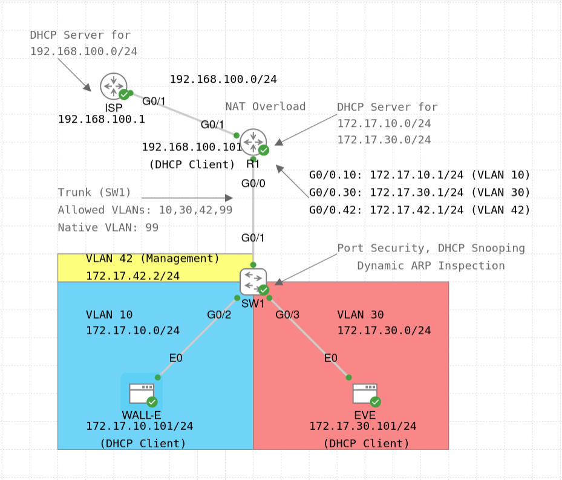

# Router-on-a-Stick Lab



The main focus of this lab is to implement inter-VLAN routing using the [Router-on-a-Stick (ROAS)](https://www.ciscopress.com/articles/article.asp?p=3089357&seqNum=5) feature.
In addition, this lab also implements the following features:
- DHCP server on the router connected to the client subnets (R1), as well as on the router that acts as an ISP router
- NAT overload (aka PAT) on the router facing the ISP (R1)
- Virtual LANs (VLANs), access and trunk ports, and management VLAN on the switch (SW1)
- Port security, DHCP snooping, and dynamic ARP inspection (DAI) on the switch (SW1)

The lab topology was inspired from the book [31 Days Before your CCNA Exam: A Day-By-Day Review Guide for the CCNA 200-301 Certification Exam](https://www.ciscopress.com/store/31-days-before-your-ccna-exam-a-day-by-day-review-guide-9780138214258) by Allan Johnson (Day 16: Inter-VLAN Routing).

The router (R1) provides connectivity for the following VLANs via its GigabitEthernet 0/0 interface:
- VLAN 10 is WALL-E's VLAN
- VLAN 30 is EVE's VLAN
- VLAN 42 is the management VLAN


Below are some comments about the lab configuration:
- R1 is configured as a DHCP server with two DHCP pools: one for VLAN 10 (subnet 172.17.10.0/24, i.e. WALL-E's subnet) and one for VLAN 30 (subnet 172.17.30.0/24, i.e. EVE's subnet). In both pools, the first 100 IP addresses are excluded, so the assignable address range is 172.17.10.101 - 172.17.10.254 for WALL-E's subnet and 172.17.30.101 - 172.17.30.254 for EVE's subnet. The lease time is set to 2 days. No DNS server address is supplied, since DNS configuration is not the focus of this lab.
- ISP is configured as a DHCP server on the interface towards R1 (i.e. G0/1). R1 uses DHCP to obtain an IP address for its ISP-facing interface (i.e. G0/1). Again, the first 100 IP addresses are excluded from the DHCP pool, so the assignable address range is 192.168.100.101 - 192.168.100.254. Given the point-to-point nature of this link, using /30 subnet mask would make more sense, however in this lab we use /24 mask to keep it simple.
- R1 implements a simple NAT overload (PAT) to translate the IP addresses of internal hosts as their traffic flows towards the ISP.
- SW1 has a management VLAN 42, with a statically configured IP address 172.17.42.2/24 and the default gateway 172.17.42.1, i.e. R1's G0/0.42 subinterface IP address (use the `show ip default-gateway` command on SW1 to verify this). The management VLAN is intended for WALL-E and EVE to be able to ssh into the switch. On R1, any (sub)interface IP address can be used to ssh into the router. Telnet is disabled on both devices.
- SW1 uses VLAN 99 as the native VLAN (which is not used in this lab), and VLAN 999 as the "black hole" VLAN for unused ports.
- The trunk between SW1 and R1 is configured as a static trunk and Dynamic Trunking Protocol (DTP) is disabled. Allowed VLANs are 10, 30, 42, and 99, with VLAN 99 being the native VLAN.
- SW1 implements port security on interfaces G0/2 and G0/3, with the maximum of 1 (dynamic) MAC address and "restrict" violation mode; the aging time is set to 16 hours (960 minutes) based on inactivity. This configuration is done just for practice reasons. For DHCP snooping and DAI, the limit rate is set to (on average) 10 packets per second (pps). For DAI, additional validation checks have been enabled (source MAC, destination MAC, and IP address, see the [Cisco tutorial](https://www.cisco.com/c/en/us/td/docs/switches/lan/catalyst9400/software/release/16-9/configuration_guide/sec/b_169_sec_9400_cg/configuring_dynamic_arp_inspection.pdf) for explanation).


Some of the useful verification commands for this lab are (change the parameters if needed):
- VLANs:
    - `show interfaces status`
    - `show interfaces G0/1 switchport`
    - `show interfaces trunk`
    - `show interfaces G0/1 trunk`
    - `show vlan [brief]`
    - `show vlan id 10`
    - `show vlan name WALL-E_VLAN`
    - `show vtp status`
- ROAS:
    - `show vlans`
    - `show ip interface brief`
    - `show ip route [connected]`
- NAT/PAT:
    - `show ip nat translations`
    - `show ip nat statistics`
- Port security:
    - `show port-security`
    - `show port-security interface G0/0`
- DHCP snooping:
    - `show ip dhcp snooping`
    - `show ip dhcp snooping binding`
    - `show ip dhcp snooping statistics [detail]`
- Dynamic ARP inspection:
    - `show ip arp inspection`
    - `show ip arp inspection statistics`
    - `show ip arp inspection interfaces`
- DHCP:
    - `show ip dhcp pool [VLAN_10_POOL]`
    - `show ip dhcp binding`
    - `show ip dhcp conflict`
    - `show ip dhcp server statistics`
    - `show dhcp lease`

To verify the configuration on hosts, you can use the `ip` command:
```sh
# Show the configuration on eth0
WALL-E:~$ ip addr show dev eth0
# Show the routing table on eth0 (including the default gateway)
WALL-E:~$ ip route show dev eth0
```

Finally, in the [pcaps](./pcaps/) directory, you can find some PCAP files, which you can open in [Wireshark](https://www.wireshark.org/) to see the packet structure:
- `DHCP_Flows.pcap` - captured on the trunk between SW1 and R1 when EVE requests an IP address from the DHCP server (i.e. R1); this file also includes one DTP message captured before DTP was disabled (use `dhcp` display filter to hide it)
- `ICMP_Pings.pcap` - captured on the trunk between SW1 and R1 when EVE pings WALL-E; to add a column for the VLAN ID, right-click on the "ID" field inside "802.1Q Virtual LAN" in any "Ethernet II" frame, and choose "Apply as Column"
- `SSH_Into_Router.pcap` - captured on the trunk between SW1 and R1 when EVE ssh'es into R1 using the IP address on R1's G0/0.30 interface (use `ssh` display filter to show only SSH messages)
- `SSH_Into_Switch.pcap` - captured on the trunk between SW1 and R1 when EVE ssh'es into SW1 using SW1's management IP address (use `ssh` display filter to show only SSH messages); note that since the packets are sent between the VLANs via the same trunk interface, Wireshark marks them as "TCP Retransmission" or "TCP Dup ACK" (you could remove this marking by right-clicking on a TCP segment, choosing "Protocol Preferences" > "Transmission Control Protocol", and unchecking "Analyze TCP sequence numbers", however you will not be able to filter the SSH messages anymore)


For more information, check the configuration of the devices (`show running-config` or `show run`), or see [the lab YAML file](./ROAS_Lab.yaml). For credentials, see the lab description.
