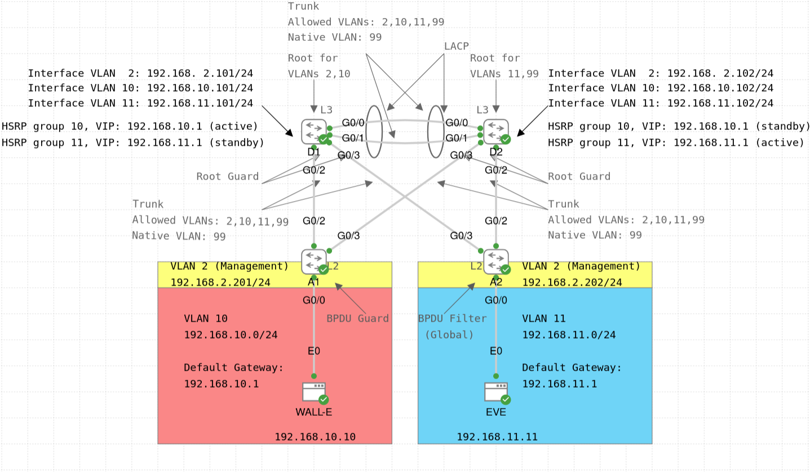

# STP and HSRP Lab

The main focus of this lab is to configure the (Rapid) Spanning Tree Protocol, specifically the Cisco proprietary [Rapid Per-VLAN Spanning Tree Plus (Rapid PVST+)](https://www.cisco.com/c/en/us/td/docs/switches/datacenter/nexus3000/sw/layer2/503_U1_1/Cisco_n3k_layer2_config_gd_503_U1_1_chapter7.html) protocol.
In addition, the lab focuses on implementing inter-VLAN routing using Layer 3 switches with [Switched Virtual Interfaces (SVIs)](https://www.ciscopress.com/articles/article.asp?p=3089357&seqNum=6).
Finally, the lab also configures the Cisco proprietary [Hot Standby Router Protocol (HSRP)](https://www.cisco.com/c/en/us/td/docs/ios-xml/ios/ipapp_fhrp/configuration/15-mt/fhp-15-mt-book/fhp-hsrp-v2.pdf) as a [First-Hop Redundancy Protocol (FHRP)](https://www.cisco.com/site/us/en/products/networking/software/ios-nx-os/first-hop-redundancy-protocol-fhrp/index.html) between the two distribution switches, as well as a [Layer 2 EtherChannel](https://www.cisco.com/en/US/docs/switches/lan/catalyst3850/software/release/3.2_0_se/multibook/configuration_guide/b_consolidated_config_guide_3850_chapter_0111110.html) between these switches.

The lab topology was inspired from the Cisco U. course [Introduction to Network Simulations with Cisco Modeling Labs](https://u.cisco.com/paths/introduction-network-simulations-with-cisco-modeling-labs-243).

The two Layer 3 distribution switches (D1, D2) provide connectivity for the following VLANs:
- VLAN 10 is WALL-E's VLAN
- VLAN 11 is EVE's VLAN
- VLAN 2 is the management VLAN

Below are some comments about the lab configuration:
- D1 is configured as the root bridge and the active HSRP router for VLAN 10 (WALL-E's VLAN), and as the backup root bridge and the standby HSRP router for VLAN 11 (EVE's VLAN). It is also the root bridge for VLAN 2 (management VLAN).
- D2 is configured as the root bridge and the active HSRP router for VLAN 11 (EVE's VLAN), and as the backup root bridge and the standby HSRP router for VLAN 10 (WALL-E's VLAN). It is also the root bridge for VLAN 99 (native VLAN, not used in this lab).
- Both D1 and D2 use HSRP version 2, and the active router (with the higher configured priority value) has preemption enabled.
- D1 and D2 have their G0/0 and G0/1 interfaces bundled into a Layer 2 EtherChannel (Port Channel) using [Link Aggregation Control Protocol (LACP)](https://www.cisco.com/c/en/us/td/docs/switches/datacenter/nexus9000/sw/7-x/interfaces/configuration/guide/b_Cisco_Nexus_9000_Series_NX-OS_Interfaces_Configuration_Guide_7x/b_Cisco_Nexus_9000_Series_NX-OS_Interfaces_Configuration_Guide_7x_chapter_0111.pdf). D1's interfaces are in the active mode, and D2's interfaces are in the passive mode.
- D1 and D2 have three VLAN interfaces (SVIs) for the three VLANs used in this lab: VLAN 10 (WALL-E's VLAN), VLAN 11 (EVE's VLAN), and VLAN 42 (management VLAN). The management VLAN is intended for WALL-E and EVE to be able to ssh into the access-layer switches (A1, A2). The management IP address is statically configured on both switches (192.168.2.201/24 and 192.168.2.202/24, respectively). Telnet is disabled on all devices.
- A1 and A2 are Layer 2 switches, have the default STP priority value (32,768), and have PortFast Edge enabled on the access ports connected to the endpoint devices (i.e. G0/0 interfaces on both switches). A1 has BPDU Guard enabled on the interface, while A2 has globally enabled BPDU Filter on all PortFast Edge interfaces (which is the G0/0 interface). In general, a consistent configuration of BPDU Guard or BPDU Filter would be better, but this lab uses both features for practice reasons (e.g. with BPDU Guard, BPDU messages are still sent out the G0/0 port, but this is not the case for BPDU Filter).
- All switches (D1, D2, A1, A2) use Rapid PVST+ mode and use the long path cost method for port cost (i.e. 32 bits instead of 16 bits). Other values (except priorities) are kept to their defaults.
- D1 and D2 have Root Guard enabled on their G0/2 and G0/3 interfaces, so that no (potential) superior BPDUs received from the access-layer switches can change the STP topology.
- All switches use VLAN 99 as the native VLAN (which is not used in this lab), and VLAN 999 as the "black hole" VLAN for unused ports.
- The trunk links between the switches are configured as static trunks and Dynamic Trunking Protocol (DTP) is disabled. Allowed VLANs are 2, 10, 11, and 99, with VLAN 99 being the native VLAN.
- A1 and A2 implement port security on the endpoint-facing interfaces (G0/0) with all default settings (i.e. the maximum of 1 dynamic MAC address and the "shutdown" violation mode).
- Since there is no DHCP server in this lab, the endpoint devices (WALL-E and EVE nodes) are manually configured with a static IP address and a default gateway.

Some of the useful verification commands for this lab are (change the parameters if needed):
- STP:
    - `show spanning-tree [vlan 10]`
    - `show spanning-tree vlan 10 interface G0/2 [detail]`
    - `show spanning-tree pathcost method`
    - `show spanning-tree bridge`
    - `show spanning-tree root [cost | port | priority | hello-time | max-age | forward-time]`
- EtherChannel:
    - `show etherchannel`
    - `show etherchannel summary`
    - `show etherchannel 1 [summary | brief | detail | port | port-channel]`
    - `show interfaces Port-Channel 1`
- HSRP
    - `show standby`
    - `show standby brief`
- Layer 3 switching using SVIs:
    - `show ip interface brief`
    - `show ip route [connected | local]`
- VLANs:
    - `show interfaces status`
    - `show interfaces G0/2 switchport`
    - `show interfaces trunk`
    - `show interfaces G0/2 trunk`
    - `show vlan [brief]`
    - `show vlan id 10`
    - `show vlan name WALL-E_VLAN`
    - `show vtp status`
- Port security:
    - `show port-security`
    - `show port-security interface G0/0`

Finally, in the [pcaps](./pcaps/) directory, you can find some PCAP files with (Rapid) PVST+ and HSRP messages, which you can open in [Wireshark](https://www.wireshark.org/) to see the packet structure:
- `STP_D2_A2.pcap` - captured on the trunk between D2 and A2 (G0/2 <--> G0/2); the Spanning Tree mode is "pvst" (you can select a frame and verify that "Spanning Tree Protocol" > "Protocol Version Identifier" is set to 0, i.e. Spanning Tree) and the path cost method is short; the file also contains some HSRP(v1) messages between D1 and D2 (use display filters `stp` or `hsrp` to show only STP or HSRP messages, respectively)
- `RSTP_D2_A2.pcap` - captured on the trunk between D2 and A2 (G0/2 <--> G0/2); the Spanning Tree mode is "rapid-pvst" (you can select a frame and verify that "Spanning Tree Protocol" > "Protocol Version Identifier" is set to 2, i.e. Rapid Spanning Tree) and the path cost method is short; the file also contains some HSRP(v1) messages between D1 and D2 (use display filters `stp` or `hsrp` to show only STP or HSRP messages, respectively)
- `RSTP_PortFast_BPDU_Guard.pcap` - captured on the access link between A1 and WALL-E, which has PortFast Edge and BPDU Guard enabled; the Spanning Tree mode is "rapid-pvst" and the path cost method is long
- `RSTP_D1_D2.pcap` - captured on the trunk between D1 and D2 (G0/0 <--> G0/0); the Spanning Tree mode is "rapid-pvst" and the path cost method is long; the file contains only STP messages and some LACP messages (note that the Port Channel had only one working link, since the G0/1 interface was shut down on both switches; this was done to capture all HSRP messages, which are available in the `HSRPv1.pcap` file)
- `HSRPv1.pcap` - captured on the trunk between D1 and D2 (G0/0 <--> G0/0) when the SVIs for VLAN 10 and 11 were enabled on both switches; the file contains only HSRPv1 messages
- `HSRPv2.pcap` - captured on the trunk between D1 and D2 (G0/0 <--> G0/0) when the SVIs for VLAN 10 and 11 were enabled on both switches (with both switches configured to use HSRPv2, i.e. `standby version 2` interface subcommand); the file contains only HSRPv2 messages

A couple of tips for the PCAP files:
- To add a column for the VLAN ID, right-click on the "ID" field inside "802.1Q Virtual LAN" in any "Ethernet II" frame, and choose "Apply as Column"
- To replace (unicast) IP addresses with host names, right-click on a packet, choose "Edit Resolved Name", and write the name (e.g. D1, D2)

For more information, check the configuration of the devices (`show running-config` or `show run`), or see [the lab YAML file](./STP_HSRP_Lab.yaml). For credentials, see the lab description.
